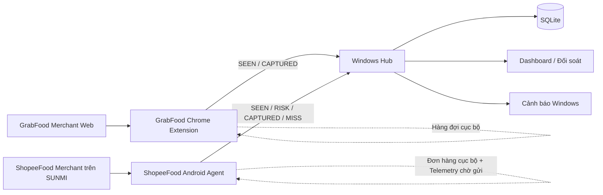
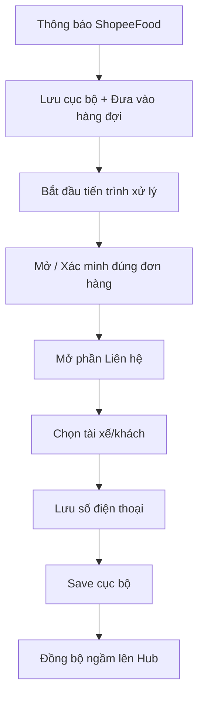

# Order Recorder System (Hệ thống Ghi nhận Đơn hàng)

> Một hệ thống tự động ghi nhận và đối soát đơn hàng đa nền tảng (GrabFood và ShopeeFood), hoạt động theo cơ chế ưu tiên lưu trữ cục bộ (local-first). Dự án được xây dựng bằng Python, Android Java, Chrome Extension Manifest V3, SQLite và tập trung vào tính ổn định thông qua hệ thống giám sát từ xa (telemetry).

[](apps/hub/)
[](apps/shopeefood-agent/)
[](apps/grabfood-extension/)
[](apps/hub/)
[](docs/ARCHITECTURE.md)

## Tổng quan

Order Recorder System là một dự án tự động hóa cấp độ thực chiến (production-oriented). Hệ thống được thiết kế để trích xuất siêu dữ liệu (metadata) của đơn hàng và thông tin liên hệ của khách hàng từ các nền tảng giao đồ ăn. Dữ liệu sau đó được lưu cục bộ, đồng bộ hóa (telemetry) về một máy chủ Windows (Hub) để đối soát, giúp phát hiện các vấn đề vận hành từ sớm nhằm tránh tình trạng mất mát dữ liệu ngầm.

Hệ thống là sự kết hợp của ba ứng dụng hoạt động độc lập:

- **Windows Hub** — Đóng vai trò là API trung tâm, lưu trữ bằng SQLite, đối soát dữ liệu, cung cấp dashboard, cảnh báo, sao lưu, import, kiểm toán (audit) và tự động nhận diện thiết bị.
- **ShopeeFood Agent** — Ứng dụng tự động hóa trên máy POS Android/SUNMI sử dụng Notification và Accessibility Service. Tích hợp cỗ máy trạng thái (state machine) có giới hạn, lưu trữ local-first, giới hạn số lần thử lại, ghi log kỹ thuật và cảnh báo rủi ro sớm.
- **GrabFood Extension** — Tiện ích mở rộng Chrome (MV3) dùng để giám sát trang quản lý của đối tác GrabFood, lưu đơn hàng cục bộ và đồng bộ dữ liệu đối soát ngầm.

Repository này hiện tại là phiên bản **tái cấu trúc theo mô hình MVC2 / Layered** từ một mã nguồn đã chạy ổn định thực tế. Việc cập nhật kiến trúc này nhằm giữ nguyên hành vi của ứng dụng hiện tại, đồng thời phân định rõ ràng các ranh giới Controller → Service → Repository → Model để dễ dàng bảo trì trong tương lai.

## Lý do tôi xây dựng hệ thống này

Bài toán kỹ thuật đặt ra ở đây không chỉ đơn giản là "đọc một số điện thoại".

Một hệ thống đáng tin cậy phải giải quyết được các vấn đề:

- Xử lý các thông báo và sự kiện trình duyệt bất đồng bộ;
- Trạng thái UI (giao diện) của bên thứ ba không ổn định;
- Độ trễ của Android Accessibility;
- Cơ chế bảo vệ để không bắt nhầm đơn hàng;
- Thử lại (retry) khi lỗi nhưng không rơi vào vòng lặp vô hạn;
- Xử lý nhiều đơn hàng đến cùng một lúc;
- Tiếp tục lưu dữ liệu cục bộ kể cả khi Hub (Máy chủ) mất kết nối;
- Gửi bù dữ liệu telemetry sau khi có mạng trở lại;
- Phân biệt rõ giữa lỗi "không nhận diện được" và lỗi "không lưu được";
- Cho phép người vận hành khôi phục và sửa lỗi thủ công;
- Xử lý các sự kiện trùng lặp (idempotent synchronization);
- Lưu log chẩn đoán lỗi nhưng vẫn phải đảm bảo quyền riêng tư của khách hàng;
- Duy trì tính ổn định của hệ thống đang chạy trong khi refactor mã nguồn cũ.

Những yếu tố này biến dự án trở thành một **bài toán về kỹ thuật hệ thống và độ tin cậy (reliability)**, chứ không chỉ là một ứng dụng CRUD thông thường.

---

## Kiến trúc Hệ thống



### Luồng xử lý phân tầng tiêu chuẩn (Layered flow)

```text
Sự kiện bên ngoài / HTTP request / Sự kiện trình duyệt
                    ↓
                Controller
                    ↓
                 Service
                    ↓
                Repository
                    ↓
                  Model
                    ↓
             Database / Storage

Controller → View / JSON / Notification
```

Kiến trúc tuân theo các quy tắc phân tách nghiêm ngặt:

- **Controllers** điều hướng các request/sự kiện.
- **Services** chứa các quy tắc nghiệp vụ và quyết định luồng công việc.
- **Repositories** quản lý ranh giới tương tác với dữ liệu (persistence).
- **Models** đại diện cho các bản ghi và DTOs.
- **Views** tuyệt đối không truy cập trực tiếp vào tầng dữ liệu.
- Các thay đổi về payload dùng chung phải được cập nhật vào `shared/contracts`.

Xem chi tiết tại: [`docs/ARCHITECTURE.md`](docs/ARCHITECTURE.md).

---

## Các Thành Phần Cốt Lõi

### 1. Windows Hub — Python + SQLite

Phiên bản mã nguồn hiện tại: **v2.2.5**

Hub là trung tâm vận hành và đối soát của toàn bộ hệ thống.

Các tính năng chính:
- Tiếp nhận API/HTTP từ các Agent;
- Lưu trữ dữ liệu với SQLite;
- Đối soát trạng thái giữa `SEEN` (Đã thấy), `RISK` (Rủi ro), `CAPTURED` (Đã lưu), và `MISS` (Thất bại);
- Xử lý sự kiện theo cơ chế lũy đẳng (idempotent);
- Giao diện dashboard và dòng thời gian của đơn hàng;
- Hiển thị các cảnh báo rủi ro sớm và các đơn bị bỏ lỡ;
- Gửi cảnh báo Native Windows;
- Cho phép thao tác khôi phục thủ công;
- Các luồng audit/edit/delete/trash/restore;
- Hỗ trợ xuất/nhập file Excel;
- Sao lưu SQLite;
- Tự động nhận diện Hub trong mạng nội bộ;
- Bảo mật các endpoint ghi dữ liệu bằng API-key.

Bản refactor MVC2 vẫn duy trì khả năng hoạt động ổn định của v2.2.5 thông qua một cầu nối legacy, trong khi các tính năng mới sẽ được phát triển theo chuẩn kiến trúc mới.

```text
apps/hub/
├── app/
│   ├── controller/
│   ├── service/
│   ├── repository/
│   ├── model/
│   ├── view/
│   └── legacy/
├── tests/
├── hub.py
└── requirements.txt
```

Chi tiết: [`apps/hub/ARCHITECTURE.md`](apps/hub/ARCHITECTURE.md)

---

### 2. ShopeeFood Agent — Android Java

Phiên bản mã nguồn hiện tại: **v2.0.10**

Agent ShopeeFood chạy trên thiết bị Android SUNMI, kết hợp giữa việc lắng nghe thông báo (Notification) và tự động hóa giao diện thông qua Accessibility Service.

Mô hình đảm bảo độ tin cậy bao gồm:
- Lưu trữ đơn hàng cục bộ;
- Hàng đợi xử lý có giới hạn;
- Chỉ xử lý một đơn hàng tại một thời điểm;
- Tối đa 3 lần thử lại (retries);
- Mỗi lần thử có 30 giây để xử lý;
- Khung thời gian 15 giây để chụp số điện thoại;
- Đơn hàng quá 8 phút sẽ không tự động xử lý nữa;
- Cơ chế chống nhầm đơn;
- Fallback bằng cách điều hướng qua thông báo;
- Lưu local trước khi đồng bộ lên Hub;
- Ghi log kỹ thuật (black-box) nhưng ẩn đi số điện thoại thực để bảo mật;
- Tự động thử gửi lại telemetry khi mất mạng;
- Bắn sự kiện `RISK` (Rủi ro) sớm trước khi quá trình tự động hóa thất bại hoàn toàn.

Luồng capture cơ bản:



### Giám sát đa cửa sổ (Window-layer observation)

Phiên bản v2.0.10 bổ sung thêm một lớp giám sát đa cửa sổ (chỉ đọc) sau khi thực hiện thao tác chọn người nhận. Lớp này quét các cửa sổ Accessibility để tìm số điện thoại mới xuất hiện mà không cần thêm các hành vi click/vuốt làm ảnh hưởng đến cỗ máy trạng thái (state machine) đang hoạt động ổn định.

### Telemetry Cảnh báo rủi ro sớm (Early-risk)

`RISK` là một sự kiện mang tính giám sát, không phải là một lệnh điều khiển.
Nó giúp Hub cảnh báo người vận hành ngay cả khi tiến trình tự động hóa vẫn đang chạy, ví dụ như:
- Thao tác mở phần liên hệ mất nhiều thời gian hơn bình thường;
- Đã bấm vào người nhận nhưng không thấy số điện thoại xuất hiện trong khung thời gian chờ.

Chi tiết: [`apps/shopeefood-agent/README.md`](apps/shopeefood-agent/README.md)

---

### 3. GrabFood Extension — Chrome Extension MV3

Phiên bản mã nguồn hiện tại: **v2.0.1**

Thành phần GrabFood hoạt động dưới dạng Tiện ích mở rộng trên Chrome.

Nhiệm vụ chính:
- Giám sát trang quản lý của nhà hàng;
- Bắt và lưu đơn hàng cục bộ;
- Đồng bộ hóa chạy nền;
- Quản lý hàng đợi telemetry cục bộ;
- Bắn sự kiện `SEEN` khi phát hiện một đơn hàng thực sự mới;
- Bắn sự kiện `CAPTURED` chỉ sau khi đã lưu local thành công;
- Tiếp tục thu thập dữ liệu ngay cả khi Hub mất kết nối;
- Giao diện Popup/Viewer;
- Hỗ trợ xuất dữ liệu ra Excel.

Bản cập nhật telemetry v2.0.1 cố tình **không** tự tạo ra sự kiện `MISS` cho GrabFood. Một đơn hàng được phát hiện nhưng không được lưu sau đó sẽ hiển thị trên Hub dưới dạng chưa hoàn thành/đang chờ (incomplete/pending).

```text
apps/grabfood-extension/
├── manifest.json
├── service-worker.js
├── src/
│   ├── controller/
│   ├── service/
│   ├── view/
│   └── legacy/
└── assets/
```

Chi tiết: [`apps/grabfood-extension/ARCHITECTURE.md`](apps/grabfood-extension/ARCHITECTURE.md)

---

## Mô hình Đối soát (Reconciliation Model)

Mục tiêu thiết kế lớn nhất là phân biệt rõ giữa **những gì hệ thống nhìn thấy (observed)** và **những gì hệ thống đã lưu thành công (captured)**.

### Các loại sự kiện

| Sự kiện | Ý nghĩa |
|---|---|
| `SEEN` | Agent đã phát hiện một đơn hàng mới |
| `RISK` | Tiến trình tự động hóa có nguy cơ thất bại |
| `CAPTURED` | Dữ liệu đơn hàng đã được lưu thành công |
| `MISS` | Tiến trình tự động hóa thất bại hoàn toàn |

Nhờ vậy, các lỗi vận hành có thể được đo lường cụ thể thay vì biến mất trong im lặng.

Vòng đời ví dụ:

```text
SEEN
  ↓
RISK ──────────────┐
  ↓                │
CAPTURED           │
                   │
hoặc               │
                   ↓
                 MISS
```

Một sự kiện `CAPTURED` sau đó có thể giải quyết một rủi ro (risk) đang hoạt động, đồng thời vẫn giữ lại lịch sử sự kiện rủi ro đó để phục vụ cho việc phân tích.

---

## Nguyên tắc Đảm bảo Độ Tin Cậy (Reliability Principles)

### Lưu trữ cục bộ trước (Local-first capture)

Việc ghi nhận đơn hàng không được phép phụ thuộc vào trạng thái kết nối của Hub.

```text
Phát hiện
  ↓
Lưu cục bộ (Local)
  ↓
Đánh dấu trạng thái local là hoàn thành
  ↓
Đồng bộ hóa chạy nền (Background sync)
```

Nếu rớt mạng hoặc Hub bị lỗi, các Agent sẽ giữ dữ liệu cục bộ và thử đồng bộ lại sau.

### Tính lũy đẳng (Idempotency)

Dữ liệu telemetry có thể được gửi lại nhiều lần. Do đó, Hub coi việc nhận được các sự kiện trùng lặp là một trạng thái bình thường thay vì xem đó là lỗi. Điều này giúp tránh việc gửi các cảnh báo vận hành hoặc sự kiện đối soát bị lặp lại.

### Tự động hóa có giới hạn (Bounded automation)

Agent trên Android không thử lại vô hạn (unlimited retries). Số lần retry, thời lượng mỗi lần thử, và độ tuổi của đơn hàng đều được giới hạn. Nhờ đó, một đơn hàng bị lỗi sẽ không thể làm nghẽn toàn bộ hàng đợi.

### Ưu tiên tính chính xác hơn thành công ảo (Correctness over silent success)

Hệ thống ưu tiên việc đưa ra cảnh báo rủi ro hoặc báo lỗi (MISS) thay vì cố đánh dấu sai một đơn hàng là đã thành công. Điều này đặc biệt quan trọng khi thao tác tự động trên giao diện của bên thứ ba, nơi nội dung hiển thị có thể bị trễ hoặc thay đổi bất ngờ.

### Giám sát không làm gián đoạn luồng chính

Các tác vụ Telemetry và chẩn đoán lỗi được thiết kế độc lập với luồng bắt đơn (capture path) chính. Ví dụ, tính năng quét cửa sổ của ShopeeFood v2.0.10 chỉ ở chế độ "đọc", và sự kiện `RISK` không làm thay đổi số lần retry, thứ tự hàng đợi, hay nhịp độ click chuột.

---

## Công Nghệ Sử Dụng

| Thành phần | Công nghệ |
|---|---|
| Windows Hub | Python |
| Database Local | SQLite |
| Dashboard | HTML / CSS / JavaScript |
| Android Agent | Java, Android SDK |
| Tự động hóa Android | Notification Listener, Accessibility Service |
| Browser Agent | Chrome Extension Manifest V3, JavaScript |
| Background Runtime | Service Worker |
| Giao tiếp dữ liệu | HTTP + JSON |
| Shared API contracts | JSON Schema |
| Android Build | Gradle |
| Đóng gói Windows | PyInstaller |
| Automation / CI | GitHub Actions |
| Kiến trúc | MVC2 / Layered Model 2 |
| Mô hình hoạt động | Local-first / Offline-tolerant |

---

## Cấu Trúc Repository

```text
order-recorder-system/
├── .github/
│   └── workflows/
├── apps/
│   ├── hub/
│   ├── shopeefood-agent/
│   └── grabfood-extension/
├── docs/
│   ├── ARCHITECTURE.md
│   ├── MIGRATION.md
│   ├── RELEASE_PROCESS.md
│   └── TREE.md
├── shared/
│   └── contracts/
├── scripts/
├── MIGRATION-MANIFEST.json
├── VERSION.json
└── README.md
```

File `VERSION.json` hiện đang xác định phiên bản kiến trúc là `mvc2-r1`, được tạo ra từ:
- Hub `2.2.5`
- ShopeeFood `2.0.10`
- GrabFood `2.0.1`

---

## Chiến lược Chuyển đổi MVC2

Repository này cố tình tránh việc "đập đi xây lại" (rewrite everything) vốn mang nhiều rủi ro.

Quy trình áp dụng cho đợt refactor đầu tiên:
1. Giữ nguyên hành vi runtime đã được kiểm chứng;
2. Tái cấu trúc code vào các ranh giới kiến trúc rõ ràng;
3. Giữ lại các cầu nối legacy (code cũ) khi cần thiết;
4. Bổ sung các bài test hồi quy (regression checks);
5. Di chuyển dần từng Use Case vào các ranh giới Controller/Service/Repository;
6. Đảm bảo code mới phát triển phải tuân thủ chuẩn kiến trúc mới.

Với Hub, runtime hiện tại được giữ lại ở `app/legacy/runtime.py`, trong khi tầng MVC2 mới sẽ đóng vai trò mở rộng. Cách tiếp cận này giúp việc cải tiến kiến trúc **có thể đo lường và có thể đảo ngược (reversible)**, thay vì phá vỡ cấu trúc và làm ảnh hưởng đến môi trường production.

---

## Thách Thức Kỹ Thuật

Một số bài toán kỹ thuật thú vị nhất trong dự án này:

### Tự động hóa UI bên thứ ba
Hệ thống không nắm quyền kiểm soát giao diện của GrabFood hay ShopeeFood. Thời gian render, điều hướng, các popup đè lên nhau, và cấu trúc Accessibility tree có thể thay đổi bất cứ lúc nào. Vì vậy, hệ thống tự động hóa cần có cơ chế xác minh, các phương án dự phòng (fallback), giới hạn số lần thử, và ghi log chẩn đoán lỗi chi tiết.

### Công bằng trong hàng đợi (Queue fairness)
Một đơn hàng bị lỗi không được phép chiếm dụng luồng tự động hóa quá lâu khiến các đơn hàng mới phải chờ đợi vô thời hạn. Agent sẽ giải phóng các lần thử bị lỗi và cấp cơ hội cho các đơn hàng khác trong hàng đợi dựa trên giới hạn an toàn đã thiết lập.

### Đồng bộ Offline
Việc thu thập dữ liệu và đồng bộ lên Hub được tách biệt hoàn toàn, đảm bảo rằng lỗi mạng sẽ không dẫn đến việc mất dữ liệu thu thập.

### Phân loại lỗi
Hub phân biệt rõ các trạng thái:
- Nhận diện đơn hàng;
- Thu thập thành công;
- Rủi ro sớm;
- Thất bại hoàn toàn;
- Khôi phục thủ công sau đó.

Sự phân tách này rất quan trọng cho việc debug. Chỉ với thông tin "Hub không nhận được số điện thoại" là không đủ để xác định lỗi nằm ở bước nhận diện, điều hướng UI, lưu DB, hay lỗi đồng bộ mạng.

### Refactor một hệ thống đang chạy Production
Dự án này cũng là một bài thực hành về việc chuyển đổi mã nguồn cũ sang một kiến trúc sạch hơn (cleaner architecture) mà không biến môi trường production thành môi trường test nghiệm thu.

---

## Hướng Dẫn Dành Cho Developer

### Hub
```bash
cd apps/hub
python hub.py
```
Các thư viện phụ thuộc được định nghĩa tại `apps/hub/requirements.txt`.

### ShopeeFood Agent
```bash
cd apps/shopeefood-agent
./gradlew assembleDebug
```
Trên Windows:
```powershell
cd apps/shopeefood-agent
.\gradlew.bat assembleDebug
```
*(Lưu ý: Thông tin chứng chỉ build release của Android không được đưa lên repository public).*

### GrabFood Extension
Để chạy thử trên máy tính (Local development):
1. Mở `chrome://extensions`;
2. Bật chế độ **Developer mode**;
3. Chọn **Load unpacked**;
4. Trỏ thư mục đến `apps/grabfood-extension/`.

---

## Kiểm Thử & QA

Repository bao gồm các script kiểm tra và QA riêng biệt cho từng component.
Ví dụ:
- Regression tests cho Hub;
- MVC2 adapter tests;
- Các script xác minh source của ShopeeFood;
- Kiểm tra cấu trúc/cú pháp JavaScript cho GrabFood;
- Các workflow tự động build/đóng gói bằng GitHub Actions.

> Các workflow CI được cấu hình dựa trên cấu trúc monorepo `apps/` và sẽ tự động kích hoạt các bài test/build tương ứng với từng component.

---

## Bảo Mật & Quyền Riêng Tư

Dự án này xử lý dữ liệu đơn hàng thực tế, vì vậy các ranh giới bảo mật là yếu tố sống còn:
- Các API ghi dữ liệu (Writer APIs) yêu cầu API key;
- Các hành động quản trị trên Hub yêu cầu xác thực;
- **Số điện thoại khách hàng không bao giờ được commit lên source code**;
- Database runtime, file export, log kỹ thuật, chứng chỉ, keys, và cấu hình local phải được loại trừ khỏi public repository;
- Việc ghi log kỹ thuật được thiết kế để không bao giờ ghi lại toàn bộ số điện thoại;
- Cảnh báo lỗi có thể định danh được đơn hàng gặp sự cố mà không cần hiển thị số điện thoại.

Repository này chỉ nhằm mục đích trình bày về kiến trúc và kỹ năng lập trình, không chứa bất kỳ dữ liệu khách hàng hay thông tin cấu hình nhạy cảm nào của môi trường production.

---

## Dự Án Này Thể Hiện Điều Gì?

Thông qua dự án này, tôi đã tích lũy được kinh nghiệm thực chiến về:
- Thiết kế hệ thống đa tiến trình / đa tác nhân (multi-agent);
- Tự động hóa bằng Android Accessibility;
- Kiến trúc Chrome Extension Manifest V3;
- Phát triển Backend với Python và SQLite;
- Áp dụng Cỗ máy trạng thái (State machines) và quy tắc giới hạn retry;
- Telemetry hướng sự kiện (event-driven);
- Thiết kế API lũy đẳng (Idempotent APIs);
- Tư duy thiết kế Local-first và chịu lỗi khi offline (offline-tolerant);
- Đối soát và giám sát vận hành (observability);
- Tái cấu trúc mã nguồn dựa trên regression test;
- Phân tích sự cố trên môi trường production;
- Xây dựng luồng CI/CD và đóng gói phần mềm;
- Duy trì hành vi của hệ thống cũ (legacy) trong khi áp dụng các ranh giới kiến trúc mới.

---

## Định Hướng Phát Triển (Roadmap)

Các mục tiêu kỹ thuật trong tương lai:
- Chuyển đổi thêm nhiều Use Case của Hub ra khỏi legacy runtime;
- Củng cố validation cho các contract dùng chung (shared contracts);
- Cải thiện telemetry theo dõi "sức khỏe" của thiết bị Android/Agent;
- Nâng cao độ chính xác khi nhận diện số điện thoại của người nhận cụ thể;
- Mở rộng regression test cho các trạng thái chuyển đổi khi gặp lỗi;
- Cập nhật CI để tối ưu hơn với cấu trúc monorepo.

---

## Tài Liệu (Documentation)

- [Kiến trúc hệ thống](docs/ARCHITECTURE.md)
- [Chiến lược chuyển đổi (Migration)](docs/MIGRATION.md)
- [Cấu trúc thư mục (Tree)](docs/TREE.md)
- [Quy trình phát hành (Release)](docs/RELEASE_PROCESS.md)
- [Kiến trúc Hub](apps/hub/ARCHITECTURE.md)
- [ShopeeFood Agent](apps/shopeefood-agent/README.md)
- [Kiến trúc GrabFood Extension](apps/grabfood-extension/ARCHITECTURE.md)

---

## Tác Giả

**Lê Văn Ngoan**  
GitHub: [@dowise](https://github.com/dowise)

*Dự án được xây dựng dưới góc độ của một hệ thống thực chiến, tập trung vào độ tin cậy, tự động hóa và kỹ thuật hệ thống.*
