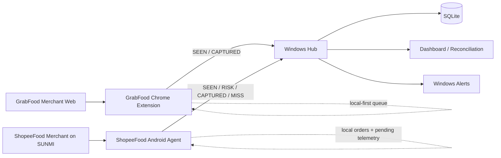
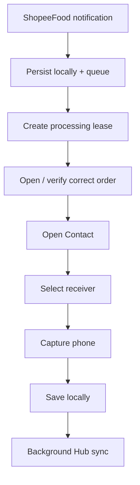

# Order Recorder System

> A local-first, multi-agent order capture and reconciliation system for GrabFood and ShopeeFood, built with Python, Android Java, Chrome Extension Manifest V3, SQLite, and reliability-focused telemetry.

[](apps/hub/)
[](apps/shopeefood-agent/)
[](apps/grabfood-extension/)
[](apps/hub/)
[](docs/ARCHITECTURE.md)

## Overview

Order Recorder System is a production-oriented automation project designed to capture order metadata and customer contact information from multiple food-delivery platforms, persist records locally, synchronize telemetry to a Windows Hub, and surface operational problems before they become silent data loss.

The system combines three independent applications:

- **Windows Hub** — central API, SQLite persistence, reconciliation, dashboard, alerts, backup, import, audit, and device discovery.
- **ShopeeFood Agent** — Android/SUNMI automation using Notification and Accessibility services, with a bounded state machine, local-first persistence, retry limits, technical logging, and early-risk telemetry.
- **GrabFood Extension** — Chrome Extension MV3 that monitors GrabFood merchant pages, captures orders locally, and synchronizes reconciliation telemetry in the background.

The current repository is an **MVC2 / layered refactor** of proven production code. The first architecture revision intentionally preserves runtime behavior while introducing clearer Controller → Service → Repository → Model boundaries for future maintenance.

## Why I built it

The engineering problem was not simply “read a phone number”.

A reliable system had to deal with:

- asynchronous notifications and browser events;
- unstable third-party UI state;
- Android Accessibility timing;
- wrong-order protection;
- retries without infinite loops;
- multiple orders arriving close together;
- local capture continuing while the Hub is unavailable;
- delayed telemetry after network recovery;
- distinguishing detection failures from capture failures;
- operator recovery and manual correction;
- duplicate events and idempotent synchronization;
- privacy-safe technical diagnostics;
- maintaining production behavior while refactoring legacy code.

This made the project primarily a **reliability and systems-engineering problem**, not a CRUD application.

---

## System Architecture



### Standard layered flow

```text
External event / HTTP request / browser event
                    ↓
                Controller
                    ↓
                  Service
                    ↓
                Repository
                    ↓
                   Model
                    ↓
             Database / Storage

Controller → View / JSON / Notification
```

The architecture follows several separation rules:

- Controllers orchestrate requests/events.
- Services contain business rules and workflow decisions.
- Repositories own persistence boundaries.
- Models represent domain records and DTOs.
- Views do not access persistence directly.
- Shared payload changes should be reflected in `shared/contracts`.

See [`docs/ARCHITECTURE.md`](docs/ARCHITECTURE.md) for the migration model.

---

## Core Components

### 1. Windows Hub — Python + SQLite

Current source baseline: **v2.2.5**

The Hub is the central reconciliation and operations layer.

Key capabilities include:

- HTTP/API ingestion from agents;
- SQLite persistence;
- reconciliation across `SEEN`, `RISK`, `CAPTURED`, and `MISS`;
- idempotent event handling;
- dashboard views and order timelines;
- early-risk and terminal-miss visibility;
- native Windows alerts;
- manual operator recovery;
- audit/edit/delete/trash/restore workflows;
- Excel import;
- SQLite backup;
- Hub auto-discovery support;
- API-key protected writer endpoints.

The MVC2 refactor keeps the proven v2.2.5 runtime available through a legacy bridge while new development moves through explicit architecture boundaries.

```text
apps/hub/
├── app/
│   ├── controller/
│   ├── service/
│   ├── repository/
│   ├── model/
│   ├── view/
│   └── legacy/
├── tests/
├── hub.py
└── requirements.txt
```

More details: [`apps/hub/ARCHITECTURE.md`](apps/hub/ARCHITECTURE.md)

---

### 2. ShopeeFood Agent — Android Java

Current source baseline: **v2.0.10**

The ShopeeFood agent runs on a SUNMI Android device and coordinates notification detection with Accessibility-based UI automation.

Its reliability model includes:

- persistent local order storage;
- bounded processing queue;
- one active order at a time;
- a maximum of 3 attempts;
- a 30-second processing lease per attempt;
- a 15-second phone-capture window;
- an 8-minute maximum age for automatic processing;
- wrong-order protection;
- notification navigation fallback;
- local save before Hub synchronization;
- technical black-box logging without intentionally logging full phone numbers;
- offline telemetry retry;
- early `RISK` events before some terminal failures.

A simplified capture flow:



### Window-layer observation

v2.0.10 adds a read-only multi-window observation layer after the receiver action. It can inspect Accessibility windows for a newly visible phone candidate without adding extra click/back/gesture behavior to the stable state machine.

### Early-risk telemetry

`RISK` is an observation event, not a control command.

It allows the Hub to warn an operator while automation is still running, for example when:

- contact navigation is taking abnormally long;
- a receiver action occurred but no phone became visible within the expected observation window.

More details: [`apps/shopeefood-agent/README.md`](apps/shopeefood-agent/README.md)

---

### 3. GrabFood Extension — Chrome Extension MV3

Current source baseline: **v2.0.1**

The GrabFood component runs as a Chrome extension.

Its responsibilities include:

- merchant-page monitoring;
- local order capture;
- background synchronization;
- local telemetry queue;
- `SEEN` when a genuinely new order is detected;
- `CAPTURED` only after local save succeeds;
- continued capture when the Hub is unavailable;
- popup/viewer UI;
- Excel generation support.

The v2.0.1 telemetry update intentionally does **not** fabricate a `MISS` event for GrabFood. A detected order without a later capture remains visible to the Hub as incomplete/pending.

```text
apps/grabfood-extension/
├── manifest.json
├── service-worker.js
├── src/
│   ├── controller/
│   ├── service/
│   ├── view/
│   └── legacy/
└── assets/
```

More details: [`apps/grabfood-extension/ARCHITECTURE.md`](apps/grabfood-extension/ARCHITECTURE.md)

---

## Reconciliation Model

A major design goal is to distinguish **what the system observed** from **what the system successfully captured**.

### Event types

| Event | Meaning |
|---|---|
| `SEEN` | A new order was detected by an agent |
| `RISK` | Automation may be heading toward a capture failure |
| `CAPTURED` | Order data was saved successfully |
| `MISS` | Automatic processing reached a terminal failure |

This makes operational failures measurable instead of silently disappearing.

Example lifecycle:

```text
SEEN
  ↓
RISK ──────────────┐
  ↓                │
CAPTURED            │
                   │
or                 │
                   ↓
                  MISS
```

A later `CAPTURED` can resolve an active risk while preserving the historical risk event for analysis.

---

## Reliability Principles

The project uses several rules that shaped the implementation.

### Local-first capture

Capturing an order must not depend on Hub availability.

```text
Detect
  ↓
Save locally
  ↓
Mark local state complete
  ↓
Synchronize in background
```

If the network or Hub is unavailable, agents keep local state and retry synchronization later.

### Idempotency

Telemetry may be retried. The Hub therefore treats repeated event delivery as an expected condition rather than an exceptional one.

This avoids duplicate operational alerts and duplicate reconciliation events.

### Bounded automation

The Android agent avoids unlimited retries.

Retries, attempt duration, and order age are bounded so one broken order cannot permanently block the processing queue.

### Correctness over silent success

The project treats an explicit warning or miss as more useful than incorrectly marking an order as successfully captured.

This is particularly important when automating third-party interfaces where visible content may be ambiguous or delayed.

### Observation should not destabilize the hot path

Telemetry and diagnostics are designed to remain independent from the core capture path whenever possible.

For example, ShopeeFood v2.0.10 window scanning is read-only and `RISK` does not alter attempts, queue ordering, or click cadence.

---

## Technology Stack

| Area | Technology |
|---|---|
| Windows Hub | Python |
| Local database | SQLite |
| Dashboard | HTML / CSS / JavaScript |
| Android agent | Java, Android SDK |
| Android automation | Notification Listener, Accessibility Service |
| Browser agent | Chrome Extension Manifest V3, JavaScript |
| Background browser runtime | Service Worker |
| Data exchange | HTTP + JSON |
| Shared API contracts | JSON Schema |
| Android build | Gradle |
| Windows packaging | PyInstaller workflow |
| Automation / CI | GitHub Actions |
| Architecture | MVC2 / Layered Model 2 |
| Operating model | Local-first / offline-tolerant |

---

## Repository Structure

```text
order-recorder-system/
├── .github/
│   └── workflows/
├── apps/
│   ├── hub/
│   ├── shopeefood-agent/
│   └── grabfood-extension/
├── docs/
│   ├── ARCHITECTURE.md
│   ├── MIGRATION.md
│   ├── RELEASE_PROCESS.md
│   └── TREE.md
├── shared/
│   └── contracts/
├── scripts/
├── MIGRATION-MANIFEST.json
├── VERSION.json
└── README.md
```

`VERSION.json` currently identifies the architecture revision as `mvc2-r1`, generated from:

- Hub `2.2.5`
- ShopeeFood `2.0.10`
- GrabFood `2.0.1`

---

## MVC2 Migration Strategy

This repository intentionally avoids a high-risk “rewrite everything” migration.

The first revision follows this process:

1. preserve proven runtime behavior;
2. reorganize code into explicit architectural boundaries;
3. retain legacy bridges where necessary;
4. add regression checks;
5. move individual use cases behind Controller/Service/Repository boundaries incrementally;
6. make new development use the new boundaries.

For the Hub, the existing runtime is retained in `app/legacy/runtime.py` while the new MVC2 layer becomes the extension point.

This approach is designed to make architecture improvement **measurable and reversible**, rather than coupling a structural rewrite with production behavior changes.

---

## Engineering Challenges

Some of the more interesting engineering problems in this project are:

### Third-party UI automation

The system does not control the GrabFood or ShopeeFood interfaces. UI timing, navigation, render delays, overlays, and Accessibility trees may change independently.

The automation therefore needs verification, fallback paths, bounded retries, and extensive diagnostics.

### Queue fairness

A failed order must not monopolize the Android automation loop while newer orders wait indefinitely.

The agent releases failed attempts and gives queued work another chance within defined safety limits.

### Offline synchronization

Agent capture and Hub synchronization are separated so network failure cannot become data-capture failure.

### Failure classification

The Hub differentiates:

- order detection;
- capture success;
- early risk;
- terminal miss;
- later operator recovery.

That separation is important for debugging because “the Hub did not receive a phone number” is not enough to identify whether the failure happened in detection, UI navigation, capture, persistence, or synchronization.

### Refactoring a working production system

The project is also an exercise in migrating a working codebase toward cleaner architecture without treating production as a test environment.

---

## Development Notes

### Hub

```bash
cd apps/hub
python hub.py
```

Dependencies are defined in [`apps/hub/requirements.txt`](apps/hub/requirements.txt).

### ShopeeFood Agent

```bash
cd apps/shopeefood-agent
./gradlew assembleDebug
```

Windows:

```powershell
cd apps/shopeefood-agent
.\gradlew.bat assembleDebug
```

Android release signing credentials should remain outside the public repository.

### GrabFood Extension

For local development:

1. open `chrome://extensions`;
2. enable **Developer mode**;
3. choose **Load unpacked**;
4. select `apps/grabfood-extension/`.

---

## Testing & QA

The repository contains component-specific QA and verification scripts.

Examples include:

- Hub regression tests;
- MVC2 adapter tests;
- ShopeeFood source verification scripts;
- GrabFood JavaScript syntax/structure checks;
- GitHub Actions build/package workflows.

> CI workflows in this portfolio baseline are aligned with the `apps/` monorepo layout and run component-specific checks/builds.

---

## Security & Privacy

This project handles operational order data, so several security boundaries are important:

- writer APIs use an API key;
- administrative Hub actions use authentication;
- customer phone numbers should never be committed to source control;
- runtime databases, exports, technical logs, credentials, signing keys, and local configuration should remain outside the public repository;
- technical logging is designed not to intentionally include full customer phone numbers;
- alerts can identify the affected order without displaying the phone number.

This repository is intended to demonstrate architecture and engineering work, not to publish production customer data or credentials.

---

## What this project demonstrates

This project gave me practical experience with:

- multi-process / multi-agent system design;
- Android Accessibility automation;
- Chrome Extension MV3 architecture;
- Python backend development;
- SQLite persistence;
- state machines and bounded retry policies;
- event-driven telemetry;
- idempotent APIs;
- local-first and offline-tolerant design;
- reconciliation and operational observability;
- regression-driven refactoring;
- production incident analysis;
- CI/CD and packaging workflows;
- maintaining legacy behavior while introducing architectural boundaries.

---

## Roadmap

Planned engineering directions include:

- migrate more Hub use cases out of the legacy runtime;
- strengthen shared contract validation;
- improve Android device/agent health telemetry;
- improve semantic confidence around receiver-specific phone capture;
- expand regression coverage around failure-state transitions;
- keep CI aligned with the monorepo structure.

---

## Documentation

- [System architecture](docs/ARCHITECTURE.md)
- [Migration strategy](docs/MIGRATION.md)
- [Repository tree](docs/TREE.md)
- [Release process](docs/RELEASE_PROCESS.md)
- [Hub architecture](apps/hub/ARCHITECTURE.md)
- [ShopeeFood agent](apps/shopeefood-agent/README.md)
- [GrabFood extension architecture](apps/grabfood-extension/ARCHITECTURE.md)

---

## Author

**Ngoan Le**  
GitHub: [@LeVanNgoan](https://github.com/LeVanNgoan)

Built as a real-world reliability, automation, and systems-engineering project.

---

<sub>Developer by Ngoan, Le Van.</sub>
